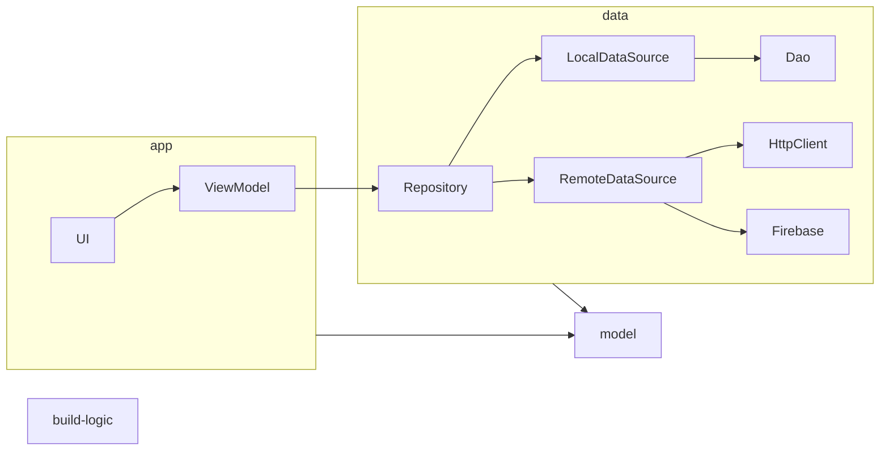

# compose-train

```mermaid
flowchart LR
    build-logic
    
    subgraph data
    Repository --> LocalDataSource
    Repository --> RemoteDataSource
    LocalDataSource --> Dao
    RemoteDataSource --> HttpClient
    RemoteDataSource --> Firebase
    end
    
    data --> model
    
    subgraph app
    UI --> ViewModel
    end
    
    ViewModel --> Repository
    
    app --> model
```
